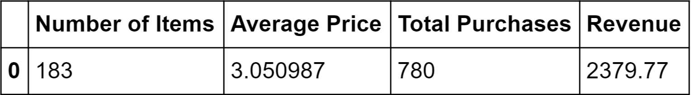
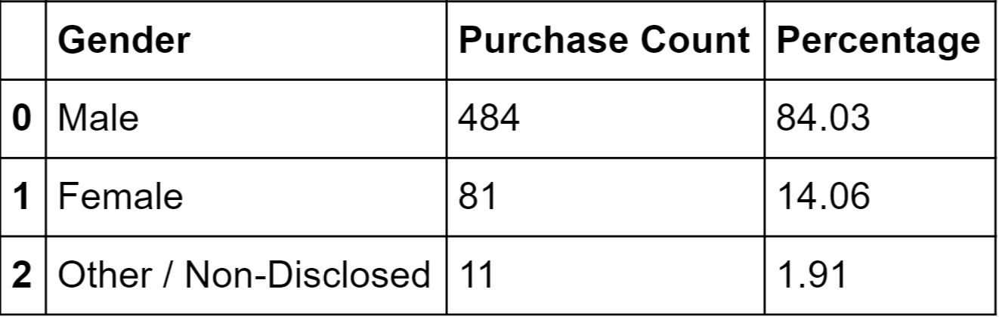
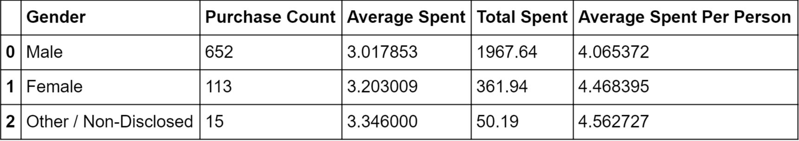
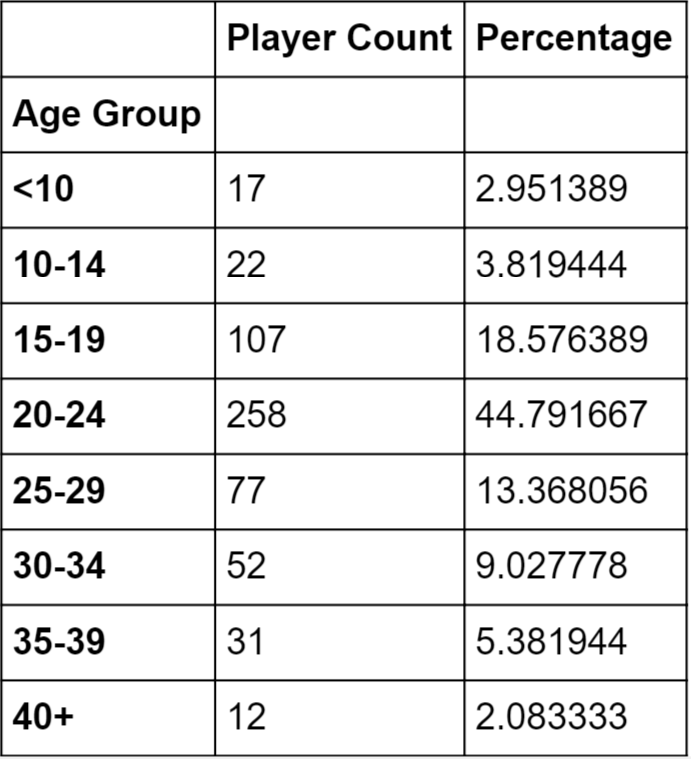
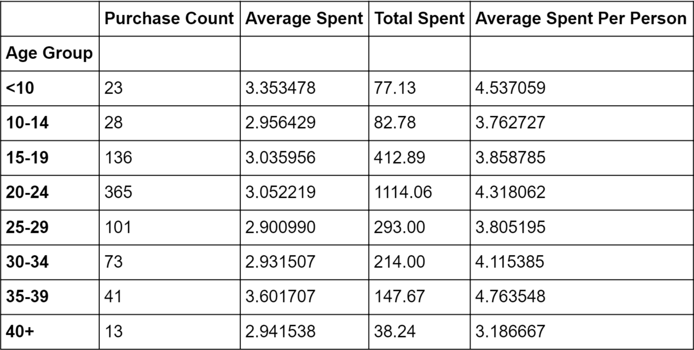
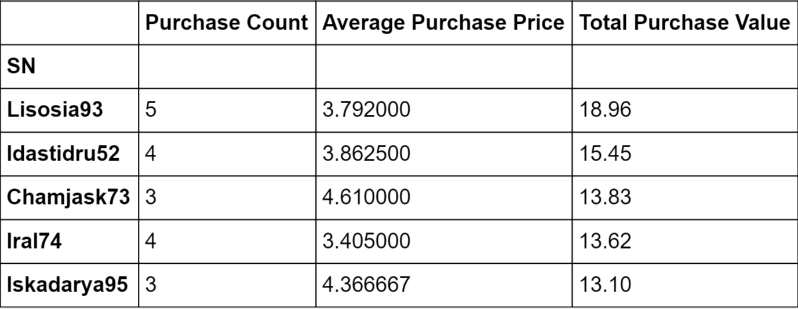
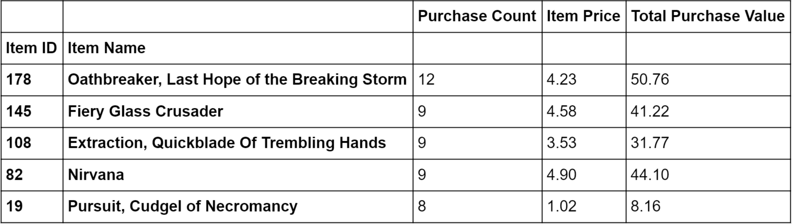
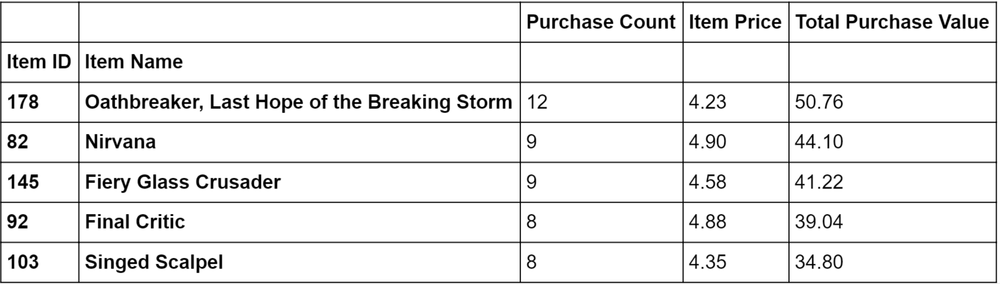

# Heroes Of Pymoli

Fictional purchasing reports from a fictional fantasy video game. The reports were generated using Python, Pandas, Numpy, and Jupyter Notebook. Each report can be viewed by either scrolling below, downloading and running the HeroesOfPymoli.py script (with accompanying resources i.e. this repo) or by opening the jupyter notebook @ https://github.com/theodoremoreland/HeroesOfPymoli/blob/master/notebooks/HeroesOfPymoli.ipynb

*This script was for a homework assignment at Washington University's Data Analytics Boot Camp (2019).*

# Results

## Purchasing Total

## Gender Demographics

## Purchasing Analysis (Gender)

## Age Demographics

## Purchasing Analysis (Age)

## Top Spenders

## Most Popular Items

## Most Profitable Items

